# Snapsite VRT overview and demo


## Google [“Snapsite VRT”](https://www.google.com/search?q=snapsite+vrt)
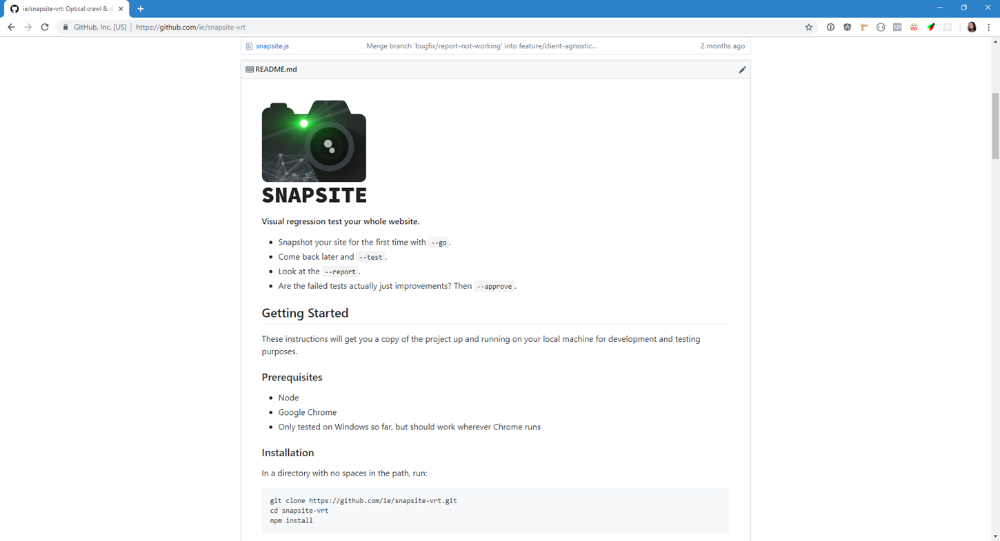

## Snapsite: *Snapshot* your site
So you can **V**isually **R**egression **T**est everything  


## It’s built on Supercrawler and BackstopJS.
Snapsite uses a few basic commands to control them.

```
--crawl takes HTML snapshots
--reference takes pictures
--test takes pictures again & compares them
--report shows you the comparison
--approve replaces reference pics with the last test pics
```

```
--crawl leaves a log of URLs
--reference reads that log (and also leaves a log)
--test reads that log (and also leaves a log, just because)
```

## Since `--go` is `--crawl` and `--reference` rolled into one, you could just do that...

```
node snapsite.js --go https://mini.com.au
```

## But chances are you’ll want to prune the list coming out of `--crawl` before you `--reference`
```
node snapsite.js --crawl https://mini.com.au
```

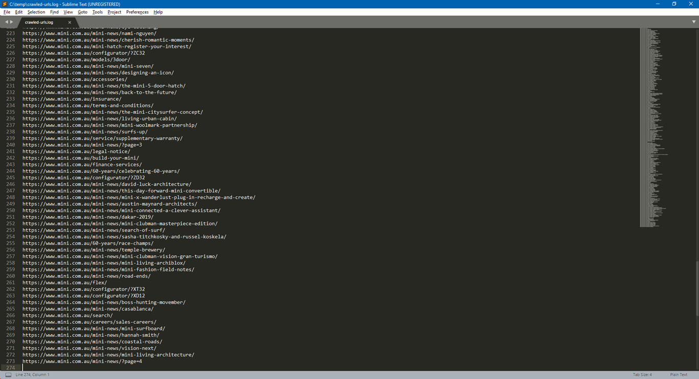

## Delete the cruft (70% of the pages are news, but not worth 70% of time taken to VRT)

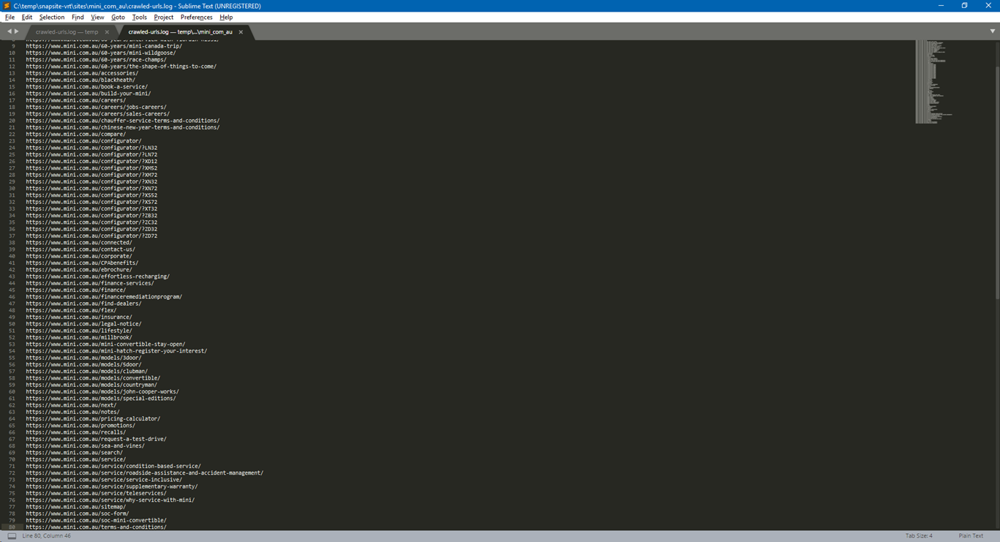

`node snapsite.js --reference https://mini.com.au`  
### (7 minutes for 80 pages x 2 sizes)
### (or ~24min / 270 pages x 2 sizes without pruning crawled-urls.log)


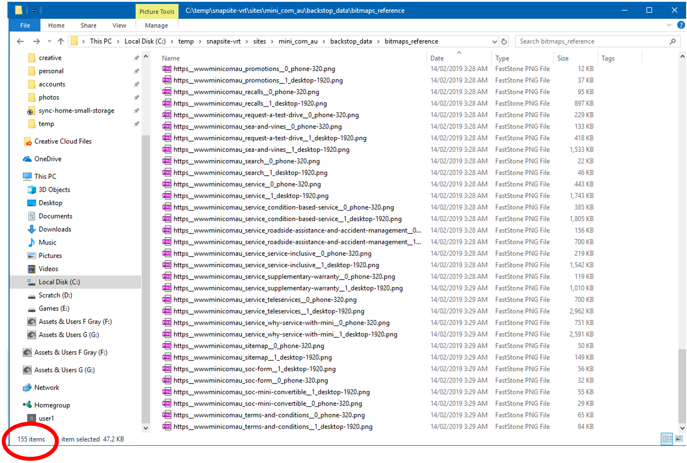

## (Yep, it randomly skips pages sometimes), Re-run the missing ones
```
node snapsite.js --reference  -o mini.com.au  -u https://www.mini.com.au/60-years/dakar-rally/      https://www.mini.com.au/configurator/      https://www.mini.com.au/configurator/?XM72      https://www.mini.com.au/models/john-cooper-works/
```

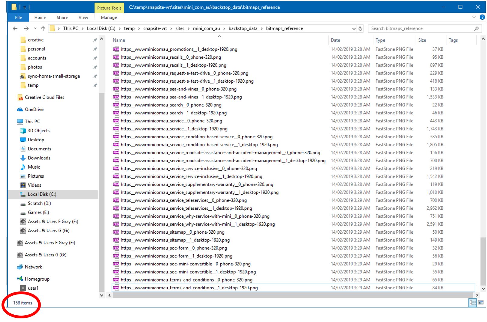

## One to go
```
node snapsite.js --reference  -o mini.com.au  -u https://www.mini.com.au/models/john-cooper-works/
```


A problematic page, no idea why
(maybe onReady.js is bugging out?)
79/80 pages is still useful


The show must go on!
Let’s remove the problematic page from:
crawled-urls.log
referenced-urls.log

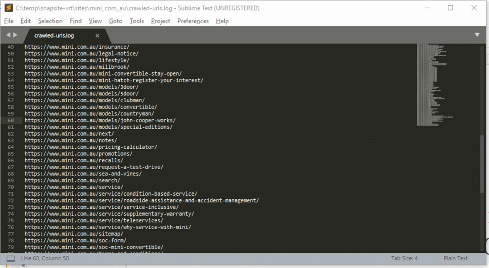

```
node snapsite.js --test https://mini.com.au
```

## Wait what are we testing?

## Stability, a change made since last --reference, etc...

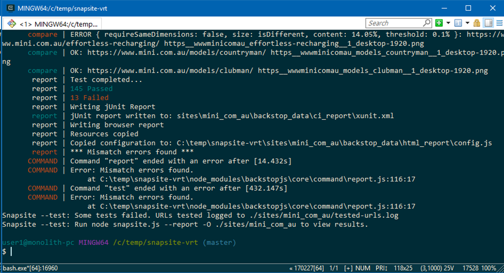

```
node snapsite.js --report https://mini.com.au
```

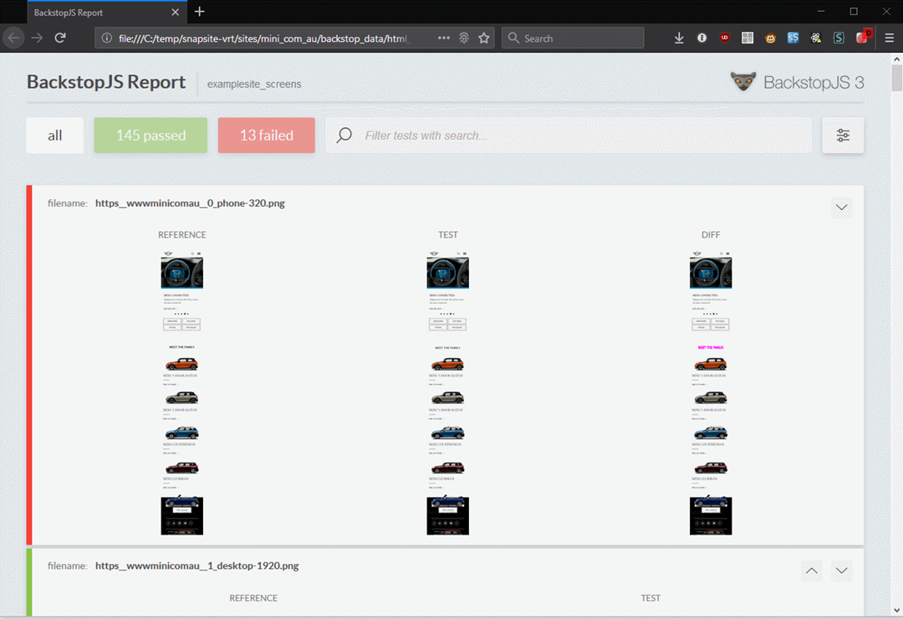

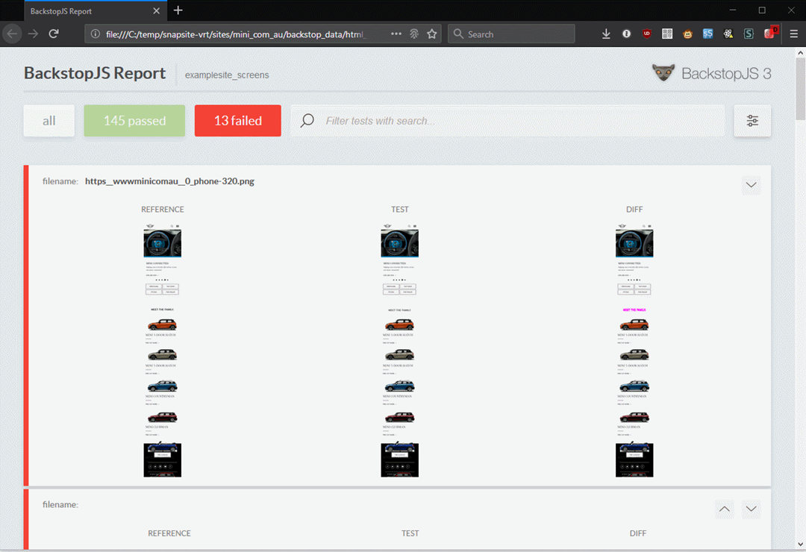

## We found page instability Address that by replacing elements in `onReady.js`

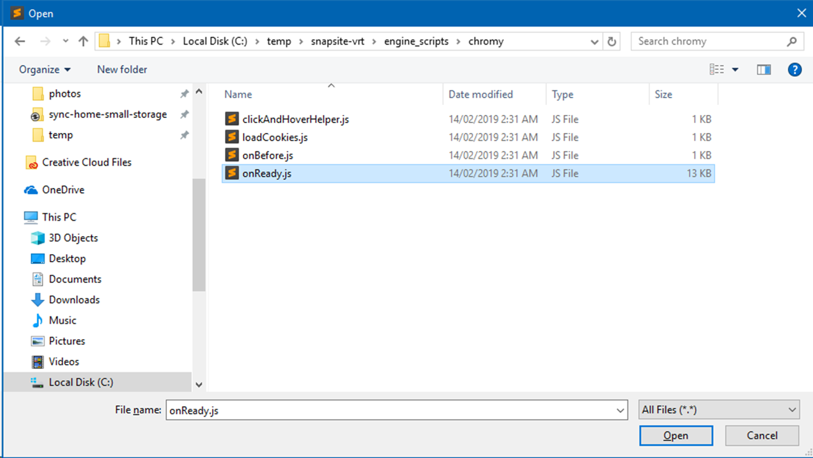

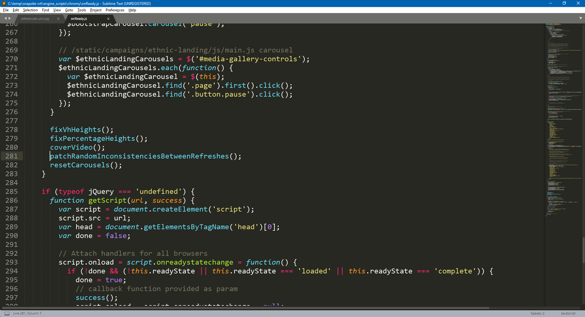

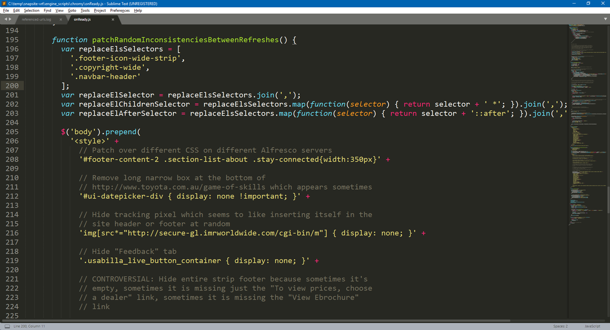

## Snapsite also supports BackstopJS’s `--approve` Mark “failures” as OK for things you *meant* to change

## Snapsite VRT has challenges

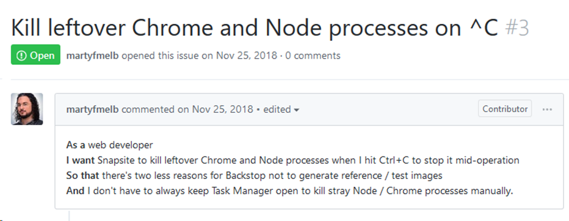

## But it also has its charms
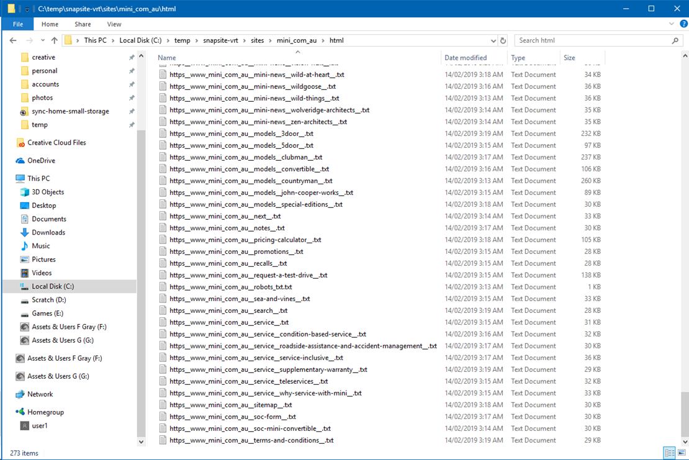

## `--crawl` keeps a copy of all pages, which you can full-text search against using e.g. FileSeek.

## Audit real-world component usage and dodgy inline styles used in production with Regex
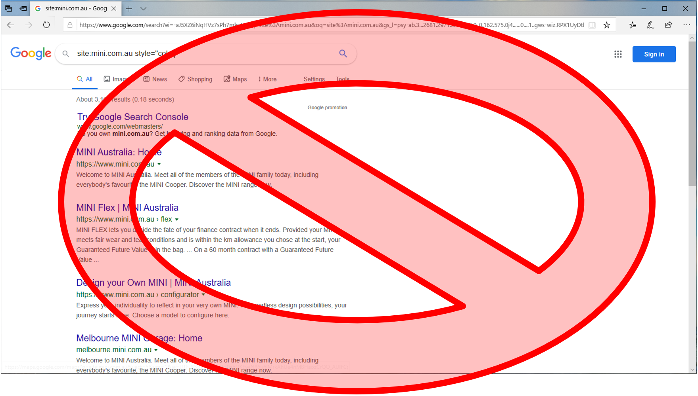

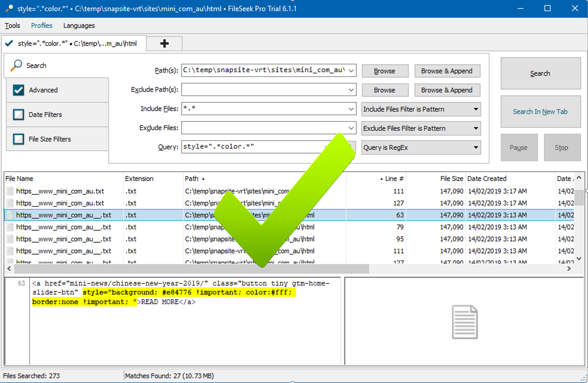


# Thanks for tuning in

